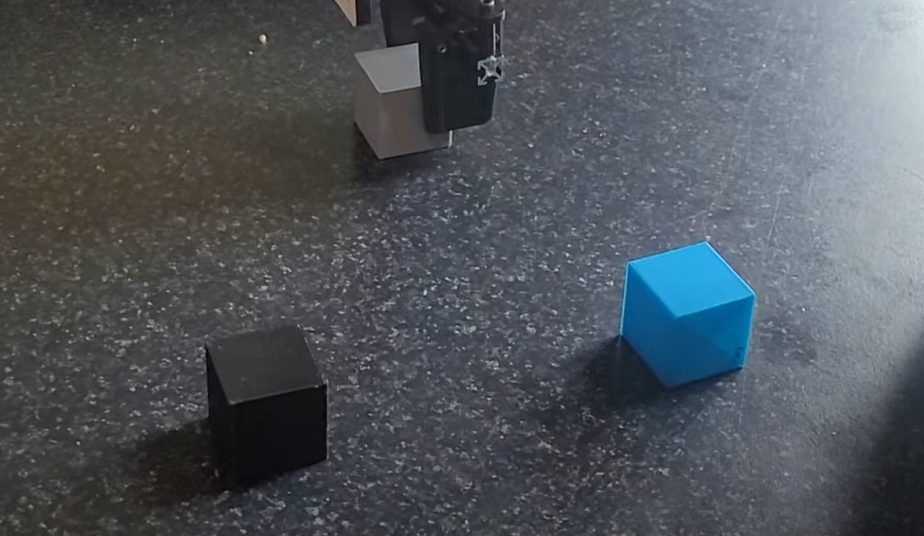

# VisionCraft

VisionCraft is a project that aims to develop a robotic system capable of building structures using various material. From either an image or a text goal, the AI pipeline will generate a plan to build the structure. The robot will then execute the plan using its gripper to pick up and place objects.

You can find a demonstration of the project here: [VisionCraft Demo](https://photos.google.com/share/AF1QipPL-GzL6EJ9Arh7R7fgsWRt19rGRXPeur0ppfUh4v-1whhdYhFNnV4n0zLO7upwQQ/photo/AF1QipOXdmjhaLZMzuexIBluUHPBuAaZPSGvp1CZKz4z?key=eHlxdGpWbG9iRHpYSGVjYnU4bjBHdEppNzF5WG5n)


## Installation

To run this project, you can start a docker container using the following command :<

```bash
docker-compose up -d --build
```

This will build the docker image and start the container. You can then enter it using vscode or any of your favorite IDE. The docker container contains everything needed to run the project, including ROS, Gazebo, and the necessary dependencies.

This will install everything except latte, for which you need to run the notebook `latte_pick_and_place_demo.ipynb`.

## High level planning

The high level planning is done using a language model. The pipeline is divided into two parts : The analyse with gpt-4o and the pointing using Molmo. The planning is currently done in one shot without corrections. The model is taking a goal image and an image of it's current state (building bloc available).

## Low level planning

For the low level planning, we used moveit trajectory as well as latte. Altought latte is integrated, the performance increase doesn't compensate for the delay required to run it. Thus, the default builder script doesn't use it.


## Running the project

```bash
catkin_make
source devel/setup.bash
```

To run the project on the real robot, you first need to launch the robot controller. You can do it in simulation or on the real robot.

### Real robot

```bash
roslaunch locobot_connector real_locobot.launch
```

### Gazebo simulation

```bash
roslaunch locobot_connector locobot_sim.launch
```

In simulation, you can add some blocks to the scene using the following command:

```bash
roslaunch locobot_connector cube_spawner.launch
```

### Adding Latte

To add Latte to the project, you can clone the repository using the following command:

```bash
git clone https://github.com/arthurfenderbucker/LaTTe-Language-Trajectory-TransformEr.git latte
```

### Starting the builder

To start the builder, you can use the following command:

```bash
python3 scripts/builder.py
```

By default, this script will try to build the an L with the blocks at disposal. You can change this by modifying the script. By default, the script run on the real robot, you must specify your IP address to run it and for the simulation, change the controller to have the simulation option.

Here is an example of what the builder was able to do (source on left, real build on right):
<p float="left">
  
  
</p>

## Baseline

To have a simple baseline for this project, we develop a curriculum learning approach with standard RL. Ulterior test show that end-to-end rl didn't wasn't able to grasp the cube, much less building something with multiple cubes. Thus, we implement multistage RL using DDPG.

- Stage 1: Reaching the cube
- Stage 2: Grasping the cube
- Stage 3: Lifting the cube
- Stage 4: Moving the cube


The use of a vision backbone was not feasable considering the complexity of the task, so we decided to the end effector position and the block position as the state space.

### Testing

To test the gym env and the baseline, you can teleop the gym environment using the following command:

```bash
python3 -m visioncraft.baseline.teleop_env
```


## Useful commands

### URDF generation

The locobot urdf that was used add an issue with one of it's wheel. Here is the code to generate a full URDF of the robot that can easiliy be modified.

rosrun xacro xacro \
  $(rospack find interbotix_xslocobot_descriptions)/urdf/locobot.urdf.xacro \
  robot_model:=locobot_wx250s \
  arm_model:=mobile_wx250s \
  base_model:=create3 \
  robot_name:=locobot \
  show_lidar:=false \
  show_gripper_bar:=true \
  show_gripper_fingers:=true \
  external_urdf_loc:="" \
> ~/ros_ws/locobot_full.urdf
